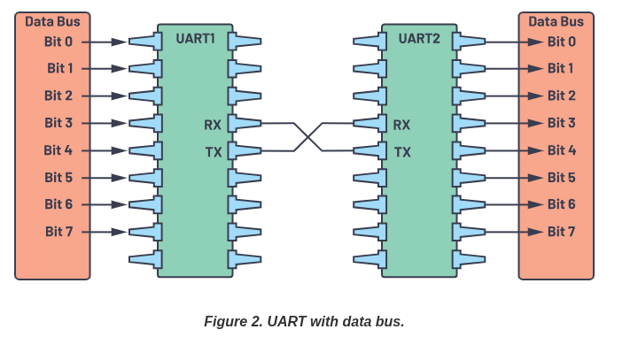

# UART
source - https://www.analog.com/en/resources/analog-dialogue/articles/uart-a-hardware-communication-protocol.html

---

## Basics

Embedded systems, microcontrollers, and computers mostly use UART as a form of device-to-device hardware communication protocol. Among the available communication protocols, UART uses only two wires for its transmitting and receiving ends.

IT is a hardware communication protocol that uses asynchrounus (no clock signal) serial communication with configurable speed.  

There are two imp signals
- transimitter
- reciever

THe main puropose is to transmit and recieve serial data intended for serial communication.

Uart lines serve as the ocmmunication medium to transmit and recieve one data to another.
From this , the data will be transmitted on the transmission line serially, bit by bit, to the recieving Uart. This converts serial data to parallel.

|Wires|qnty|
|-----|----|
|Speed|9600,19200,38400 etc|
|Method of transmission|asynchrounous|
|Max no. of masters|1|
|Max no. of slaves|1|