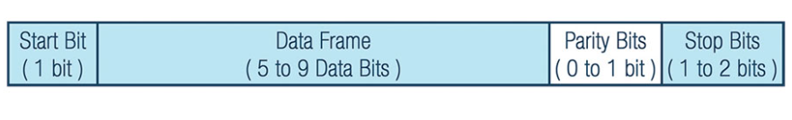

# UART
source - https://www.analog.com/en/resources/analog-dialogue/articles/uart-a-hardware-communication-protocol.html

---

## Basics

Embedded systems, microcontrollers, and computers mostly use UART as a form of device-to-device hardware communication protocol. Among the available communication protocols, UART uses only two wires for its transmitting and receiving ends.

IT is a hardware communication protocol that uses asynchrounus (no clock signal) serial communication with configurable speed.  

There are two imp signals
- transimitter
- reciever

THe main puropose is to transmit and recieve serial data intended for serial communication.

Uart lines serve as the ocmmunication medium to transmit and recieve one data to another.
From this , the data will be transmitted on the transmission line serially, bit by bit, to the recieving Uart. This converts serial data to parallel.

|Wires|qnty|
|-----|----|
|Speed|9600,19200,38400 etc|
|Method of transmission|asynchrounous|
|Max no. of masters|1|
|Max no. of slaves|1|

---

## Data Transmission

UART is in the form of a packet - the peice that connects transmitter and reciever.

- Start bit - Data transmission line is usually high (no data transmission). To start the transmission line is pulled from high to low for one clock cycle. When the reciving UART detects the high to low voltage transition , it begins reading the bits in the data frame at the frequency of the baud rate.

- Data frame - Contains the acutal data can be 5 to 8 bits long if a parity bit is used. If no parity it can transmit upto 9 bits. Least significat bit sent first.

- Parity bit - to check data integrity.

- Stop bits - TO signal the end of the data packet.

---

## Steps 
- the tranmitting UART receives dat in parallel from the data bus.
- the trnsmitting UART adds the start bit, parity bit and stop bits to the data frame.
- the entire packet is sent serially starting from start bit to stop bit from transmitting UART to the reciving UART. The recieving UART samples the data line at the preconfigured baud rate.
- The recieving UART discards the start bit, parity bit and stop bit from data frame.
- The reciving UART converts the serial data back into parallel and transfers it to the data bus on the reciving end.
